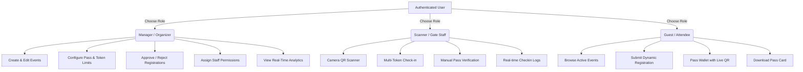
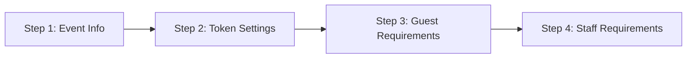

# 🎟️ EVENTPASS — Complete System Architecture & Function Documentation

> **Comprehensive Technical & Functional Guide for the EventPass Application**  
> *Everything you need to know about the application structure, role-based workflows, views, components, services, database models, and Android deployment.*

---

## 📌 Table of Contents

1. [Application Overview](#-application-overview)
2. [Tech Stack & Architecture](#-tech-stack--architecture)
3. [Project Directory & File Structure](#-project-directory--file-structure)
4. [User Roles & Access Control (RBAC)](#-user-roles--access-control-rbac)
5. [Views & Pages Breakdown (Layout & Functions)](#-views--pages-breakdown-layout--functions)
   - [1. Authentication (`AuthView.tsx`)](#1-authentication-authviewtsx)
   - [2. Organizer Dashboard (`ManagerDashboard.tsx`)](#2-organizer-dashboard-managerdashboardtsx)
   - [3. Event Creation Wizard (`CreateEventWizard.tsx`)](#3-event-creation-wizard-createeventwizardtsx)
   - [4. Guest & Pass Management (`GuestManagement.tsx`)](#4-guest--pass-management-guestmanagementtsx)
   - [5. Staff & Scanner Management (`StaffManagement.tsx`)](#5-staff--scanner-management-staffmanagementtsx)
   - [6. High-Speed Live Scanner (`LiveScanner.tsx`)](#6-high-speed-live-scanner-livescannertsx)
   - [7. Attendee Portal & Pass Wallet (`GuestHome.tsx`)](#7-attendee-portal--pass-wallet-guesthomettsx)
   - [8. QR Code Studio (`QrGeneratorView.tsx`)](#8-qr-code-studio-qrgeneratorviewtsx)
   - [9. User Profile & Preferences (`ProfileView.tsx`)](#9-user-profile--preferences-profileviewtsx)
   - [10. Notification Center (`NotificationsView.tsx`)](#10-notification-center-notificationsviewtsx)
6. [Reusable UI Components (`src/components/`)](#-reusable-ui-components-srccomponents)
7. [State Management & Context (`AppContext.tsx`)](#-state-management--context-appcontexttsx)
8. [Backend Services & Firebase Layer](#-backend-services--firebase-layer)
   - [Authentication Service (`authService.ts`)](#authentication-service-authservicets)
   - [Database & Storage Service (`dbService.ts`)](#database--storage-service-dbservicets)
9. [Utilities & Media Engines (`src/utils/`)](#-utilities--media-engines-srcutils)
10. [Database Schema & Firestore Rules](#-database-schema--firestore-rules)
11. [Android APK Build & Deployment Guide](#-android-apk-build--deployment-guide)
12. [End-to-End User Workflows](#-end-to-end-user-workflows)

---

## 🚀 Application Overview

**EventPass** is an all-in-one Event Management, Digital Ticketing, and Gate Verification ecosystem. It is built as a cross-platform progressive application that runs smoothly on **Web Browsers (Desktop & Mobile)** and as a native **Android Application** using Capacitor.

### Key Capabilities:
- 🎫 **Custom Pass & Token Generation**: Supports single passes or multiple tokens per attendee (e.g., 1 to 15+ admissions per ticket).
- 🛡️ **Zero-Fraud Gate Check-in**: Real-time camera QR scanning with Web Audio feedback, duplicate prevention, and partial/full check-in counters.
- 📋 **Dynamic Requirement Builder**: Organizers can customize registration requirements per event (Live Selfie capture, ID upload, PDF documents, custom questions).
- 👥 **Role-Based Access Control**: Instant switching between **Manager/Organizer**, **Gate Scanner/Staff**, and **Guest/Attendee**.
- ⚡ **Offline-First & Fast Sync**: Seamless Firebase Firestore integration with local storage caching for zero-latency UI interactions.

---

## 🛠️ Tech Stack & Architecture

| Layer | Technology Used | Description |
| :--- | :--- | :--- |
| **Frontend Framework** | **React 18 (TypeScript)** | Functional components, custom hooks, and strict type safety |
| **Build Tool & Bundler** | **Vite 6** | Ultra-fast HMR and optimized production bundling |
| **Mobile Runtime** | **Capacitor 6** | Native Android bridge, hardware camera access, and APK packaging |
| **Backend & Database** | **Firebase Firestore** | Real-time NoSQL cloud database with live snapshot subscriptions |
| **Authentication** | **Firebase Auth** | Email/Password auth, session persistence, and password reset |
| **Cloud Storage** | **Firebase Storage** | Profile avatars, event banners, and guest ID document uploads |
| **QR Engine** | **qrcode & jsQR** | Dynamic canvas QR generation & high-frequency video stream decoding |
| **Audio Synthesizer** | **Web Audio API** | Real-time synthesized chimes, error buzzers, and UI clicks |
| **Icons & Styling** | **Lucide React & CSS3** | Custom dark glassmorphism design system (`design-system.css`) |

---

## 📂 Project Directory & File Structure

```
Event pass/
├── android/                        # Capacitor Android native project files
│   ├── app/                        # Android build scripts, assets & manifests
│   └── build.gradle                # Gradle configuration
├── css/                            # Global CSS stylesheets
│   ├── design-system.css           # Core theme variables, typography, gradients & badges
│   ├── components.css              # Styling for cards, modals, tables, scanners & buttons
│   └── responsive.css              # Media queries, mobile navigation & safe-area insets
├── public/                         # Static assets (favicons, logos, sounds)
├── scripts/                        # Database initialization & maintenance scripts
│   ├── initFirebaseCollections.mjs # Script to initialize Firestore collections & dummy data
│   └── cleanDummyData.mjs          # Script to purge testing/dummy entries
├── src/                            # Source code root
│   ├── components/                 # Global UI components
│   │   ├── BottomNav.tsx           # Mobile bottom navigation bar
│   │   ├── DigitalPassModal.tsx    # Interactive digital pass modal with QR & barcode
│   │   ├── LiveCameraModal.tsx     # Custom live selfie/ID capture modal
│   │   ├── Navbar.tsx              # Top desktop/mobile navigation header
│   │   ├── RoleSwitcherModal.tsx   # Fast role switcher (Manager / Scanner / Guest)
│   │   ├── Sidebar.tsx             # Collapsible desktop sidebar navigation
│   │   └── ToastContainer.tsx      # Global notification toast popups
│   ├── context/                    # State management
│   │   └── AppContext.tsx          # Central application state, hooks, and actions
│   ├── services/                   # Cloud backend interfaces
│   │   ├── authService.ts          # Firebase Authentication methods
│   │   └── dbService.ts            # Firestore CRUD & Cloud Storage sync
│   ├── types/                      # TypeScript definitions
│   │   └── index.ts                # Interfaces for Users, Events, Passes, Staff, Logs
│   ├── utils/                      # Helper libraries
│   │   ├── audio.ts                # Web Audio API sound generator (chimes, clicks, errors)
│   │   ├── image.ts                # Image compression and base64 converters
│   │   └── qr.tsx                  # QR code generation utilities
│   ├── views/                      # Application views/pages
│   │   ├── AuthView.tsx            # Login, Registration & Password Recovery
│   │   ├── CreateEventWizard.tsx   # 4-step event creation & token builder
│   │   ├── GuestHome.tsx           # Attendee event portal, pass wallet & registrations
│   │   ├── GuestManagement.tsx     # Organizer attendee table, approvals & CSV export
│   │   ├── LiveScanner.tsx         # Fast gate QR camera scanner & token check-in
│   │   ├── ManagerDashboard.tsx    # Organizer metrics, live feed & overview
│   │   ├── NotificationsView.tsx   # System notifications & alerts list
│   │   ├── ProfileView.tsx         # User profile settings & account details
│   │   ├── QrGeneratorView.tsx     # Custom QR code design studio & bulk generator
│   │   └── StaffManagement.tsx     # Staff recruitment, approvals & permission toggles
│   ├── App.tsx                     # Main layout container & view router
│   ├── firebase.ts                 # Firebase app initialization & config
│   └── main.tsx                    # React DOM root entry point
├── build-apk.bat                   # 1-click Windows batch script to build Android APK
├── capacitor.config.json           # Capacitor application config
├── firestore.rules                 # Cloud Firestore security rules
├── index.html                      # HTML template with fonts and meta tags
├── package.json                    # Project dependencies and npm scripts
├── schema.sql                      # Reference relational database schema
├── tsconfig.json                   # TypeScript compiler configuration
└── vite.config.ts                  # Vite build tool configuration
```

---

## 👥 User Roles & Access Control (RBAC)

The system is built on a 3-tier Role-Based Access Control model:



### 1. 👔 Manager (Event Organizer)
- Full administrative control over all events.
- Build custom registration fields and token parameters.
- Review attendee registrations, view attached documents, and approve/reject with 1-click.
- Appoint gate staff, grant scanning/check-in privileges, and monitor check-in rates.

### 2. 🛡️ Scanner (Gate Staff / Volunteer)
- Dedicated gate verification interface.
- High-speed camera scanner powered by `jsQR` with torch and flip support.
- Multi-token validator (e.g. deducts tokens per head for multi-ticket passes).
- Audio and visual pass validity indicators (Valid, Already Checked-in, Invalid).

### 3. 🎟️ Guest (Event Attendee)
- Explore available events and view schedules, venues, and descriptions.
- Register with custom required fields (Live selfie, ID photo, academic roll number, etc.).
- Access personal Pass Wallet to view valid QR passes, token counters, and download passes.

---

## 🖥️ Views & Pages Breakdown (Layout & Functions)

### 1. Authentication (`AuthView.tsx`)
**Location:** `src/views/AuthView.tsx`  
**Purpose:** Handles all user onboarding, authentication, and initial role configuration.

#### Core Functions & Features:
- **Tabbed Authentication**: Toggle between **Sign In**, **Sign Up**, and **Forgot Password**.
- **Role Selection on Registration**: Users can register as **Organizer (Manager)**, **Gate Staff (Scanner)**, or **Attendee (Guest)**.
- **Profile Picture Upload & Live Camera Capture**: Integrated `LiveCameraModal` enables users to snap a live selfie directly or upload an image file with automatic base64 compression.
- **Fast Local & Firebase Sign-In**: Authenticates against Firebase Auth with automatic profile fetching and fallback caching.
- **Password Reset**: Triggers Firebase `sendPasswordResetEmail` with instant toast feedback.

---

### 2. Organizer Dashboard (`ManagerDashboard.tsx`)
**Location:** `src/views/ManagerDashboard.tsx`  
**Purpose:** Serves as the primary operational command center for event organizers.

#### Core Functions & Features:
- **Event Switcher**: Dropdown selector to switch context between different organized events.
- **Key Performance Metric Cards**:
  - *Total Capacity / Registered Guests*
  - *Check-in Rate (%)*
  - *Pending Approvals Count*
  - *Active Gate Staff Count*
- **Quick Action Hub**: 1-click navigation to:
  - *Create New Event Wizard*
  - *Guest List & Approvals*
  - *Gate Scanner Mode*
  - *Staff Permissions*
  - *QR Code Studio*
- **Live Activity Feed**: Real-time stream of recent gate check-ins and registration requests with time stamps.

---

### 3. Event Creation Wizard (`CreateEventWizard.tsx`)
**Location:** `src/views/CreateEventWizard.tsx`  
**Purpose:** A step-by-step wizard to configure all parameters of a new or existing event.

#### Wizard Step Breakdown:


- **Step 1: Basic Event Details**
  - Event Name, Tagline, Date, Start Time, End Time, Venue, and Location.
  - Cover Image upload with live preview and compression.
  - Description and Organizer details.
- **Step 2: Pass & Token Configuration**
  - **Total Seat/Pass Capacity**: Maximum passes that can be issued.
  - **Tokens Per User / Pass**: Configure multi-entry tickets (e.g., 1 pass contains 5 or 15 admission tokens).
  - **Token Prefix**: Custom alphanumeric prefix (e.g. `TECH26-`).
  - **Auto-Generation & QR Format**: Dynamic QR code toggle.
- **Step 3: Dynamic Guest Requirements Builder**
  - Build custom registration forms with 18+ field types:
    - `live_photo` (Enforces live camera snapshot)
    - `id_card` & `image_upload`
    - `pdf_upload` (ID proof, college letter, receipts)
    - `college`, `branch`, `roll_number`
    - `dropdown`, `radio`, `checkbox`, `custom_question`
  - Toggle required/optional status and add field descriptions.
- **Step 4: Staff Requirements & Document Attachments**
  - Define custom fields required from staff applicants.
  - Upload event documents (rules, brochures, maps) accessible to attendees.

---

### 4. Guest & Pass Management (`GuestManagement.tsx`)
**Location:** `src/views/GuestManagement.tsx`  
**Purpose:** Complete attendee database table with filtering, approvals, and audit capabilities.

#### Core Functions & Features:
- **Status Filter Tabs**: View attendees by status: `All`, `Invited`, `Pending`, `Approved`, `Checked-in`, `Rejected`, `Blocked`.
- **Search & Sort**: Real-time search across Attendee Name, Email, Mobile, College, Token Code, and Pass ID.
- **Direct Guest Entry**: Add manual guests on the spot with pre-assigned tokens.
- **1-Click Approvals & Rejections**: Approve or reject pending registration requests with instant notification dispatch.
- **Multi-Token Overview**: Shows total assigned tokens vs. already scanned tokens (e.g., `3/15 Admitted`).
- **Pass Details Modal**: Opens full guest profile with live document preview, answer sheet, and dynamic QR pass.
- **CSV Data Export**: Export guest roster to spreadsheet-compatible CSV format.

---

### 5. Staff & Scanner Management (`StaffManagement.tsx`)
**Location:** `src/views/StaffManagement.tsx`  
**Purpose:** Manage security personnel, volunteers, and gate scanning staff.

#### Core Functions & Features:
- **Staff Roster & Invitation**: Add staff members by email, name, phone, and assign them to specific events.
- **Volunteer Application Review**: Review staff signups, inspect uploaded credentials/documents, and approve them.
- **Granular Permission Matrix**: Toggle permissions per staff member:
  - `canScan`: Access camera scanner.
  - `canCheckIn`: Mark tokens/passes as checked in.
  - `canViewDetails`: Inspect attendee sensitive info.
  - `canApprove`: Approve guest registrations.
  - `canReject`: Reject attendee passes.
- **Account Status**: Enable or disable staff access with a single toggle.

---

### 6. High-Speed Live Scanner (`LiveScanner.tsx`)
**Location:** `src/views/LiveScanner.tsx`  
**Purpose:** High-throughput camera scanner for security gates to verify QR codes and admit attendees.

#### Core Functions & Features:
- **Real-Time Video Stream Scanner**: Continuous canvas frame decoding via `jsQR` targeting 60fps scanning.
- **Camera Controls**:
  - Flip between **Rear Camera (Environment)** and **Front Camera (User)**.
  - Flashlight / Torch toggle for low-light venue environments.
- **Sound Engine (`audio.ts`)**:
  - 🔔 *Success Chime*: Synthesized pleasant dual-tone on valid pass.
  - 🚨 *Error Buzzer*: Low-frequency alert tone on invalid/duplicate/blocked pass.
  - 🎚️ Sound on/off toggle.
- **Multi-Token Stepper Admission**:
  - For passes with multiple tokens (e.g. 15 passes for a group), the scanner displays remaining tokens and lets the gatekeeper admit 1 or more tokens at a time with live counter deductions.
- **Manual Search & Token Entry**: Fallback keyboard input to verify attendees by Token code, Email, or Mobile when camera is unavailable.
- **Check-in Audit Logger**: Logs every successful admission with timestamp, gate officer name, and token index to Firestore.

---

### 7. Attendee Portal & Pass Wallet (`GuestHome.tsx`)
**Location:** `src/views/GuestHome.tsx`  
**Purpose:** The attendee hub for discovering events, registering, and managing digital tickets.

#### Core Functions & Features:
- **Event Catalog**: Browse active, upcoming, and featured events with cover banners, venues, and timings.
- **Dynamic Registration Modal**:
  - Dynamically renders the exact fields configured by the organizer.
  - Integrated webcam snapshot modal for mandatory live selfie verification.
  - File uploaders for PDF tickets and ID cards with instant preview.
- **"My Passes" Digital Wallet**:
  - Displays all approved event passes.
  - Renders high-resolution dynamic QR code and Pass ID.
  - Displays live token count progress bar (e.g., `0 of 15 Tokens Used`).
  - **Pass Download & Print**: 1-click generation of styled printable ticket card.

---

### 8. QR Code Studio (`QrGeneratorView.tsx`)
**Location:** `src/views/QrGeneratorView.tsx`  
**Purpose:** Dedicated QR Code generator and styling studio.

#### Core Functions & Features:
- **Custom QR Generator**: Generate custom QR codes for arbitrary text, links, WiFi credentials, or custom token sequences.
- **Branding & Styling**:
  - Custom foreground and background colors.
  - Embedded logo upload inside QR center.
  - Error correction level adjustments (`L`, `M`, `Q`, `H`).
- **Export Formats**: Instant download as PNG or SVG images.
- **Batch Generator**: Bulk generate QR codes for pre-defined seat numbers or token lists.

---

### 9. User Profile & Preferences (`ProfileView.tsx`)
**Location:** `src/views/ProfileView.tsx`  
**Purpose:** User account management, credential updating, and personal activity history.

#### Core Functions & Features:
- **Profile Customization**: Update Full Name, Contact Number, College, and Branch.
- **Avatar Management**: Upload new profile photo or snap live selfie via webcam.
- **Subpage Navigation**:
  - *My Events*: Quick list of events created or registered.
  - *My Tickets*: Direct pass wallet access.
  - *History*: Past scan logs and audit check-ins.
  - *Settings*: Notification and UI preferences.
  - *Support*: Help desk contact and guidelines.
- **Role Switcher Integration**: Quick launcher to change active persona.

---

### 10. Notification Center (`NotificationsView.tsx`)
**Location:** `src/views/NotificationsView.tsx`  
**Purpose:** Real-time inbox for system notifications, ticket status updates, and broadcast messages.

#### Core Functions & Features:
- **Categorized Alerts**: Badges for `success`, `info`, `warning`, and `error`.
- **Targeted Notifications**: Filters messages by recipient user ID and role (`manager`, `staff`, `guest`, `all`).
- **Mark as Read & Clear All**: 1-click action to dismiss or delete alerts.

---

## 🧩 Reusable UI Components (`src/components/`)

| Component | File Path | Description |
| :--- | :--- | :--- |
| **Navbar** | `src/components/Navbar.tsx` | Top desktop/mobile navigation header with logo, event title, active role indicator, notifications badge, and profile dropdown. |
| **Sidebar** | `src/components/Sidebar.tsx` | Collapsible desktop side navigation menu with icon links tailored to the user's active role. |
| **BottomNav** | `src/components/BottomNav.tsx` | Mobile navigation bar anchored to the bottom with active route highlighting and quick scanner launcher. |
| **DigitalPassModal** | `src/components/DigitalPassModal.tsx` | Full-screen interactive digital ticket showing QR code, barcode, token indicators, pass details, and download button. |
| **LiveCameraModal** | `src/components/LiveCameraModal.tsx` | Hardware camera modal for live selfie capture and ID card photos with camera switching and crop previews. |
| **RoleSwitcherModal** | `src/components/RoleSwitcherModal.tsx` | Modal dialog allowing users to switch active persona (Organizer, Gate Staff, Attendee) on the fly. |
| **ToastContainer** | `src/components/ToastContainer.tsx` | Floating toast alert container displaying animated success, warning, and error banners with auto-dismiss. |

---

## ⚡ State Management & Context (`AppContext.tsx`)

The global application state is managed by `AppContext.tsx` (`useApp()` hook), providing single-source-of-truth reactivity throughout the entire component tree.

### State Variables:
- `user: UserProfile`: Current logged-in user profile, role, avatar, and academic info.
- `events: EventItem[]`: List of all events synced from Firestore with real-time listeners.
- `guests: GuestRegistration[]`: All registered guests, ticket tokens, approval statuses, and check-in records.
- `staff: StaffMember[]`: Staff directory and permission mappings.
- `notifications: NotificationItem[]`: Active user notifications.
- `scanLogs: ScanHistoryRecord[]`: Real-time scan history stream.
- `checkins: CheckinAuditRecord[]`: Check-in audit ledger for security verification.
- `currentView: string`: Active view route identifier (`dashboard`, `create_event`, `guests`, `staff`, `scanner`, `guest_home`, etc.).
- `activePassGuestId: string | null`: Controls which digital pass is open in `DigitalPassModal`.

### Key Context Actions:
- `login(userProfile)` / `logout()`: Handles session state and authentication teardown.
- `navigate(view)`: Switches the current active view.
- `switchRole(role)`: Switches active role (`manager`, `scanner`, `guest`) and adapts navigation.
- `saveEvent(event)` / `deleteEvent(id)`: Upserts and removes events with Firestore sync.
- `saveGuest(guest)` / `updateGuestStatus(id, status)`: Handles guest registrations, approvals, rejections, and check-ins.
- `checkInSingleToken(guestId, tokenCode, scannerName)`: Deducts a single token from a multi-token pass and updates check-in count.
- `saveStaff(member)` / `updateStaffPermission(id, key, val)`: Updates staff capabilities in real time.
- `showToast(message, type, title)`: Dispatches dynamic toast notifications across the application.

---

## 🌐 Backend Services & Firebase Layer

### Authentication Service (`authService.ts`)
- `firebaseSignIn(email, password, preferredRole)`: Authenticates user with Firebase Auth, fetches user profile from `users` Firestore collection within a 2-second timeout, and falls back to local storage cache if offline.
- `firebaseSignUp(email, password, name, role, mobile, college, branch, avatar)`: Registers user in Firebase Auth, initializes document in `users` collection, writes staff record if role is `scanner`, and generates a welcome notification.
- `firebaseResetPassword(email)`: Dispatches password reset emails through Firebase.
- `firebaseSignOut()`: Signs out of Firebase Auth and clears active session memory.

### Database & Storage Service (`dbService.ts`)
Interacts with Firebase Firestore collections:
1. **`events`**: CRUD operations + `subscribeToEvents()` real-time snapshot listener.
2. **`guests`**: Attendee records + `subscribeToGuests()` listener.
3. **`staff`**: Staff permissions + `subscribeToStaff()` listener.
4. **`scan_logs`**: Live scan history records + `subscribeToScanLogs()`.
5. **`checkins`**: Gate check-in audit records + `subscribeToCheckins()`.
6. **`notifications`**: User alerts + `subscribeToNotifications()`.
7. **`users`**: User profile repository + `syncUserProfileToDb()`.
8. **`uploadBase64ImageToStorage(base64, path)`**: Uploads compressed images to Firebase Cloud Storage and returns the public download URL.

---

## 🔊 Utilities & Media Engines (`src/utils/`)

### 1. Web Audio Engine (`src/utils/audio.ts`)
Generates real-time sound effects using the browser's native `AudioContext` (no external audio files needed):
- `sound.success()`: Plays a high-frequency ascending 2-tone melodic chime (`523.25 Hz` -> `659.25 Hz`) for valid pass check-ins.
- `sound.error()`: Plays a low-frequency square-wave buzzer (`180 Hz` -> `130 Hz`) for invalid or duplicate passes.
- `sound.click()`: Plays a subtle UI click tap (`800 Hz`).
- `sound.toggle()` / `sound.isMuted()`: Mute/unmute toggle.

### 2. Image Compression Engine (`src/utils/image.ts`)
- `compressImage(file, maxWidth, maxHeight, quality)`: Resizes uploaded photos on an HTML5 canvas and exports compressed JPEG Base64 strings to ensure fast Firestore storage and minimal bandwidth usage.
- `dataURLtoBlob(dataUrl)`: Converts Base64 data URLs to binary Blob formats for Cloud Storage uploads.

### 3. QR Generation Engine (`src/utils/qr.tsx`)
- `generateQRCodeDataUrl(text, options)`: Uses the `qrcode` library to render QR code matrices on 2D canvas with custom color palettes, logos, and error correction levels.

---

## 📊 Database Schema & Firestore Rules

### Firestore Security Rules (`firestore.rules`)
```javascript
rules_version = '2';
service cloud.firestore {
  match /databases/{database}/documents {
    // Authenticated users can read and write events, guests, staff, logs and notifications
    match /events/{eventId} {
      allow read: if true;
      allow write: if request.auth != null;
    }
    match /guests/{guestId} {
      allow read: if true;
      allow write: if true; // Allows public event registration
    }
    match /staff/{staffId} {
      allow read, write: if request.auth != null;
    }
    match /users/{userId} {
      allow read, write: if true;
    }
    match /scan_logs/{logId} {
      allow read, write: if request.auth != null;
    }
    match /checkins/{checkinId} {
      allow read, write: if request.auth != null;
    }
    match /notifications/{notifId} {
      allow read, write: if true;
    }
  }
}
```

---

## 📱 Android APK Build & Deployment Guide

EventPass includes full Capacitor Android integration with hardware camera access configured in Android Manifest.

### Quick Build with `build-apk.bat`:
Double-click `build-apk.bat` in the root folder, or run in terminal:
```powershell
.\build-apk.bat
```

### Manual Step-by-Step Build:
1. **Build the Web Bundle**:
   ```bash
   npm run build
   ```
2. **Sync Web Code to Capacitor Android Project**:
   ```bash
   npx cap sync android
   ```
3. **Open Android Studio for APK Generation**:
   ```bash
   npx cap open android
   ```
4. In Android Studio:
   - Go to **Build** > **Build Bundle(s) / APK(s)** > **Build APK(s)**.
   - The compiled debug APK will be generated at:  
     `android/app/build/outputs/apk/debug/app-debug.apk`

---

## 🔄 End-to-End User Workflows

### 🌟 Workflow 1: Organizer Creates an Event
1. Organizer logs in and clicks **"Create Event"** (`CreateEventWizard.tsx`).
2. Fills in Event Name, Date, Venue, and uploads a Cover Image.
3. Sets Pass Limit and assigns **Tokens Per User** (e.g. `15 tokens` per pass).
4. Adds dynamic requirements: **Live Selfie Photo** (required) and **College ID Card** (required).
5. Clicks **"Publish Event"**. Event instantly syncs to Firestore and appears on the public catalog.

---

### 🎟️ Workflow 2: Attendee Registers & Obtains Pass
1. Attendee opens EventPass in Guest Mode (`GuestHome.tsx`).
2. Browses the event and clicks **"Register Now"**.
3. Fills in personal details, clicks **"Take Live Selfie"** to capture camera photo, and uploads ID document.
4. Submits form. Status is set to `Pending` (or `Approved` if auto-approve is active).
5. Once approved, the pass appears in **"My Passes"** wallet with an interactive QR code and 15 token credits.

---

### 🛡️ Workflow 3: Gate Staff Scans & Admits Attendees
1. Security/Scanner logs in and opens **"Gate Scanner"** (`LiveScanner.tsx`).
2. Points phone camera at attendee's digital pass QR code.
3. `jsQR` decodes token instantly:
   - If Valid: **Success Chime 🔔** sounds, attendee photo and details display on screen.
   - If Multi-Token: Scanner clicks **"Check In (1/15)"** or selects token quantity to admit.
   - If Already Used or Invalid: **Error Buzzer 🚨** sounds with warning indicator.
4. Check-in audit record is logged to Firestore in real time.

---

*Documentation prepared for the EventPass Application repository.*
